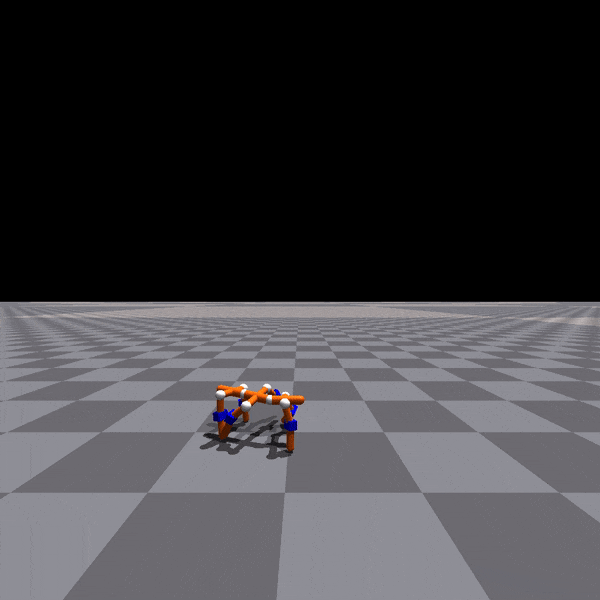

# N-LIMB: Neural Limb Optimization for Efficient Morphological Design

  
  
  

This repository contains code for the paper N-LIMB: Neural Limb Optimization for Efficient Morphological Design, currently under review at CoRL 2022.

It provides training code, pretrained models, and scripts to visualize and evaluate training runs.

## Installation

Our code relies on [Docker](https://www.docker.com/get-started) and the docker wrapper [cpk](https://github.com/afdaniele/cpk) to manage its dependencies.

To use this codebase, follow these installation steps:

1. Intstall Docker.
2. Install cpk: `python -m pip install cpk==0.5.0`
3. Clone this repository.
4. From the top level directory, run `cpk build` to build the docker container.
5. You can enter the container by running `cpk run -M -f -X -- --runtime=nvidia`.

Additionally, this codebase uses [Weights and Biases](https://wandb.ai/site) for logging and visualization, which is free to use for academics.
Running a training job will prompt you to login, create an account, or not visualize the results.
If you wish to avoid manual logins, place your wandb `.netrc` file in the `assets/wandb_info` directory.

Creating a wandb account is only required if you want to track and visualize training runs.

## Visualizing Pretrained Models

This repository contains three pretrained models, one for each terrain used in our experiments. 
They are provided in the `exps` directory.

- To visualize a trained model, run: `cpk run -M -f -X -L viz ++ exps/nlimb_walls --num_envs 1 -- --runtime=nvidia`
- To record a video of a trained model, run: `cpk run -M -f -X -L record ++ exps/nlimb_walls -- --runtime=nvidia`

Replace `exps/nlimb_walls` with another log directory as needed.

## Training from scratch

This repository also provides the complete training code used in our experiments.

To launch a new experiment, run: `cpk run -M -f -L train ++ configs/nlimb.gin -- --runtime=nvidia`

This codebase uses [Gin Config](https://github.com/google/gin-config) for configuration. 
The provided config `configs/nlimb.gin` trains an agent on the random walls terrain using the same hyperparameters as the pretrained model. 
